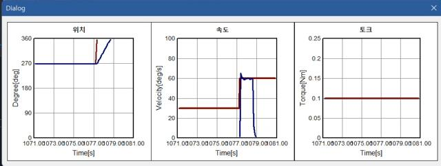
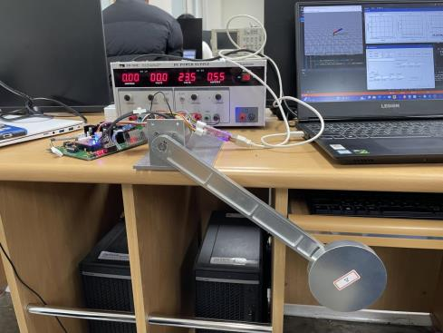
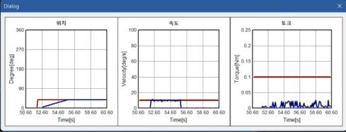
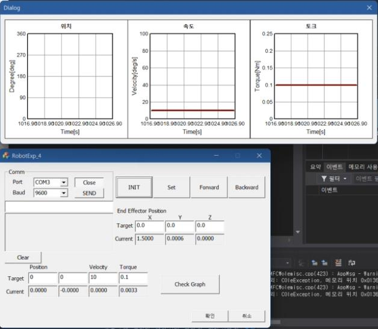

# 🤖 Robot Arm Control Project (로봇팔 제어 프로젝트)

## 🔹 프로젝트 개요
이 프로젝트는 **DC 모터 및 기어드 모터의 제어 시스템을 설계하고, 시뮬레이션 및 실험을 통해 성능을 검증**하는 것을 목표로 합니다.  
로봇팔의 모터를 조작하여 **위치, 속도, 토크 제어를 수행**하며, 제어기의 안정성과 응답성을 평가합니다.

## 🚀 사용 기술
- **🖥️ 개발 환경**: MATLAB Simulink, C (AVR), Python  
- **🔌 마이크로컨트롤러**: ATmega128  
- **🎮 제어 방식**: PID 제어 (PI, PD, Cascade Control)  
- **📊 실험 도구**: 모터, 엔코더, 전류 센서, UART 통신  

---

## ⚙️ 제어기 설계 원리

본 프로젝트에서는 **Cascade Control (계단식 제어기)**를 활용하여 **전류, 속도, 위치**를 정밀하게 조작하였습니다.  
Cascade Control은 **각 단계마다 별도의 제어 루프를 적용**하여 전체적인 제어 안정성을 높이는 방식입니다.

### 🔹 **제어기 설계**
1. **전류 제어기 (Current Controller) - PI 제어**
   - 빠른 전류 응답을 위해 **비례-적분(PI) 제어기 적용**
   - 인덕턴스(La)와 저항(Ra)를 고려하여 게인(Kp, Ki) 튜닝
   - Anti-Windup 기법 적용하여 과도한 적분 누적 방지

2. **속도 제어기 (Speed Controller) - PI 제어**
   - 속도 지령을 기반으로 적절한 전류를 출력하는 역할
   - **비례 게인(Kp)**: 속도 응답을 빠르게 조절  
   - **적분 게인(Ki)**: 정상 상태 오차 제거  

3. **위치 제어기 (Position Controller) - PD 제어**
   - 목표 위치에 정확히 도달하도록 보정하는 역할
   - **비례 게인(Kp)**: 목표 위치에 빠르게 수렴  
   - **미분 게인(Kd)**: 속도 변화에 대한 보정으로 Overshoot 방지  

---

## 🖥️ 시뮬레이션 환경
본 프로젝트에서는 실제 하드웨어 실험을 수행하기 전에 **MATLAB 기반 시뮬레이션 환경을 구축**하여 제어 알고리즘을 테스트하였습니다.

### 📸 **시뮬레이션 화면**

### 📊 **시뮬레이션 결과**
아래는 위치, 속도, 토크 제어 결과를 시각화한 그래프입니다.

---

## 🛠️ 하드웨어 실험
로봇팔의 모터 제어를 실험하기 위해 **ATmega128 기반의 커스텀 PCB 보드**를 제작하였으며, 실제 하드웨어에서의 응답성을 검증하였습니다.

### 📸 **실제 실험 장치**

### 📊 **실험 결과 그래프**
하드웨어 테스트에서 얻은 위치, 속도, 토크 응답 그래프입니다.

---

## 🖥️ UI 인터페이스
로봇팔을 실시간으로 제어하고 데이터 시각화를 수행하기 위한 **GUI 프로그램**을 개발하였습니다.

### 📸 **GUI 프로그램 화면**

GUI를 통해 **목표 위치를 설정하고, 속도 및 토크를 조정할 수 있으며, 실시간 데이터 모니터링이 가능합니다**.

---

## 📌 결론 및 향후 계획
- **Cascade Control을 활용한 로봇팔 제어의 성능을 성공적으로 검증**
- **MATLAB 시뮬레이션과 실제 하드웨어 실험을 병행하여 알고리즘 최적화**
- 향후 **더 정밀한 제어기 (예: LQR, Adaptive Control) 추가 개발 예정**

---

## 📩 문의
프로젝트에 대한 문의 사항은 [이메일](mailto:wkrldowk1@gmail.com)로 연락 주세요! 😊

