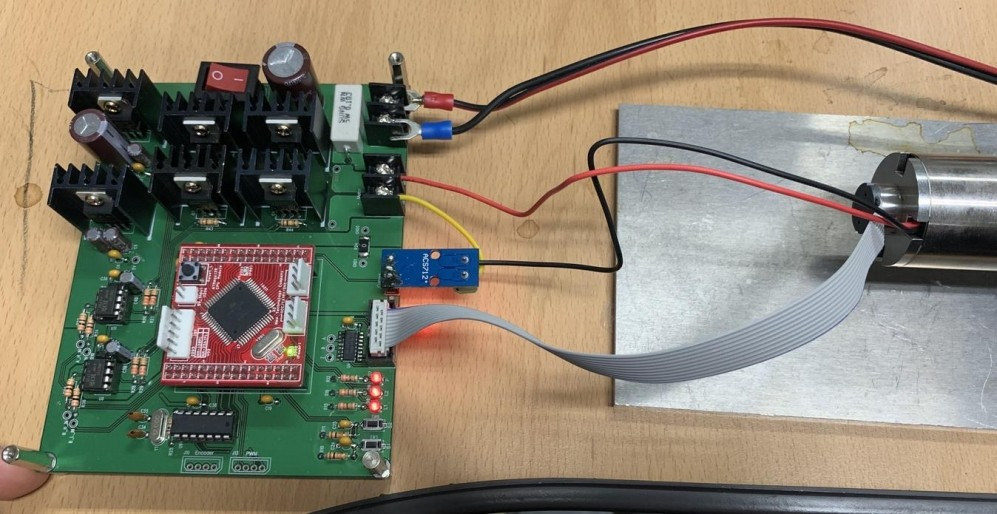

# 🤖 Robot Arm Control Project (로봇팔 제어 프로젝트)

## 🔹 프로젝트 개요
이 프로젝트는 **DC 모터 및 기어드 모터의 제어 시스템을 설계하고, 시뮬레이션 및 실험을 통해 성능을 검증**하는 것을 목표로 합니다.  
로봇팔의 모터를 조작하여 **위치, 속도, 토크 제어를 수행**하며, 제어기의 안정성과 응답성을 평가합니다.

## 🚀 사용 기술
- **🖥️ 개발 환경**: MATLAB Simulink, C (AVR), Python  
- **🔌 마이크로컨트롤러**: ATmega128  
- **🎮 제어 방식**: PID 제어 (PI, PD, Cascade Control)  
- **📊 실험 도구**: 모터, 엔코더, 전류 센서, UART 통신  

---

## ⚙️ 제어기 설계 원리

본 프로젝트에서는 **Cascade Control (계단식 제어기)**를 활용하여 **전류, 속도, 위치**를 정밀하게 조작하였습니다.  
Cascade Control은 **각 단계마다 별도의 제어 루프를 적용**하여 전체적인 제어 안정성을 높이는 방식입니다.

### 🔹 **제어기 설계**
1. **전류 제어기 (Current Controller) - PI 제어**
   - 빠른 전류 응답을 위해 **비례-적분(PI) 제어기 적용**
   - 인덕턴스(La)와 저항(Ra)를 고려하여 게인(Kp, Ki) 튜닝
   - Anti-Windup 기법 적용하여 과도한 적분 누적 방지

2. **속도 제어기 (Speed Controller) - PI 제어**
   - 속도 지령을 기반으로 적절한 전류를 출력하는 역할
   - **비례 게인(Kp)**: 속도 응답을 빠르게 조절  
   - **적분 게인(Ki)**: 정상 상태 오차 제거  

3. **위치 제어기 (Position Controller) - PD 제어**
   - 목표 위치에 정확히 도달하도록 보정하는 역할
   - **비례 게인(Kp)**: 목표 위치에 빠르게 수렴  
   - **미분 게인(Kd)**: 속도 변화에 대한 보정으로 Overshoot 방지  

---

## 🛠️ 하드웨어 구성
로봇팔 제어기를 구현하기 위해 **ATmega128** 기반의 **커스텀 PCB 보드**를 제작하여 사용하였습니다.  
이 보드는 **DC 모터 드라이버, 엔코더 입력, 전류 센서 및 전력 공급 회로**를 포함하고 있습니다.

### 📸 **하드웨어 회로 및 PCB 사진**
**제어 블록 다이어그램**  

**모터 드라이버 및 전류 센서 인터페이스**  

**모터와 연결된 테스트 환경**  

---

